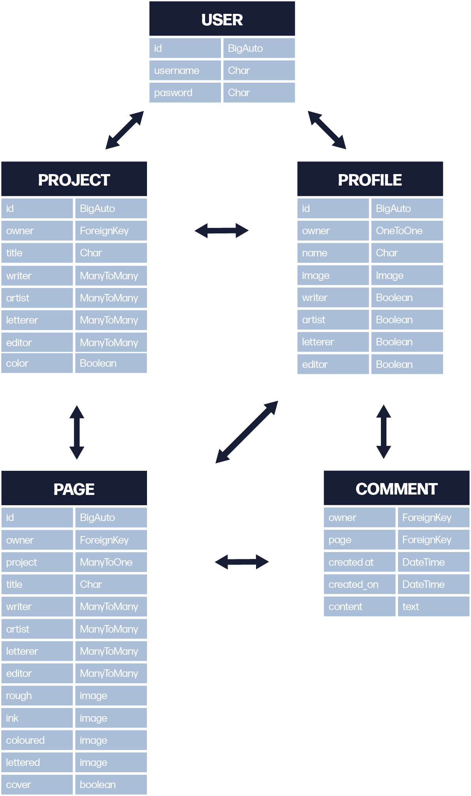

# **MakeCOMICS-api - application programming interface for the project management app makeComics**

This project is part of my fifth milestone project for the Code Institute Diploma in Full Stack Software Development. 
You can see the final deployed site [here.](https://make-comics.herokuapp.com/)

The api is designed to handle data for the makeComics projectmanagement app.

* [UX](#ux)
    * [User Stories](#user-stories)
    * [Database schema](#database-schema)

* [Testing](#testing)
* [Technologies Used](#technologies-used)
    * [Languages](#languages)
    * [Packages and frameworks](#packages-and-frameworks)
    * [API](#api)
    * [Version Control](#version-control)
    * [Other Software](#other-software)
* [Deployment](#deployment)
* [Credits](#credits)
    * [Content](#content)
    * [Acknowledgements](#acknowledgements)

## UX
### User Stories

#### **Users should be able to create an account so their settings can persist over multiple sessions.** 

* Users should be able to regisiter for an account so that they can create projects 
* Users should be able to regisiter for an account so that they can have a profile picture assosiated with their account
* Users should be able to rigister for an account so that they can invite collaborators to comment on and update their projects
* Users should be able to delete their accounts so that they can ensure their data is not on the app when they no longer want to use the account
* Users should be able to see projects they are collaborators on so that they can easily access their projects

### Database schema

To help sketch out what data would be needed and how best to store it I created the following diagram; 

## Technologies Used

[Link to External testing document](./TESTING.md)

## Technologies Used

### Languages

* Python - the code was written in python

### Packages and frameworks
* React - the site was built using the react framework.

### Version Control

* Github - All version control was handled through Github. 

### Other Software
* [Adobe Illustrator](https://www.adobe.com/uk/products/illustrator.html) - was used to create the database schema. 

## Testing

[Link to External testing document](./TESTING.md)

## Deployment

The app is deplpoyed via [Heroku](https://www.heroku.com/). If you have cloned the repo follow the steps below to deploy your own version. 

1. Go to the [Heroku website](https://heroku.com/) and log in to your account. If you have not made one yet first create an account.

2. On the home page click the new button and then click create new app. 

3. On the next page enter a name for the app. This has to be unnique. You cannot use the same name as I have. Then enter your location before clicking create app. 

4. Click on the resources tab and then add-ons. Use the search bar to locate Heroku Postgres database and add it to the application. 

5. Go to the setting tab and click reveal config vars. Copy the URL value for the DATABASE_URL. 

6. Create the following config vars. CLIENT_ORIGIN, CLOUDINARY_URL, DISABLE_COLLECTSTATIC, SECRET_KEY

7. Populate DISABLE_COLLECTSTATIC with 1,  CLOUDINARY_URL with your CLOUDINARY details (if you don't have a cloudinary account create one), the SECRET_KEY with a random string of numbers. Do not share this data with anyone.  

8. Populate your client_origin with your makeComics clone. If you haven not created that yet follow the instructions for that [here](https://github.com/John-McPherson/advanced-front-end-portfolio-project-front-end).

9. Click on the config vars section. 

10. if you haven't already link your github account to your heroku account

11. Click on the Deploy tab on Heroku and scroll down to the deployment method and Select Github. 

12. Scrol down to the app connected to Github section and locatate your cloned directory and connect it to the cloned directory. 

13. Select main branch in the manual deployment section and click deploy branch. 

## **Credits**

### **Content**

The majority of code that is not included as part of a framework or libary was was written by me with the following exceptions;

### **Acknowledgements** 

* My mentor [Mbakwe Caleb](https://github.com/caleboau2012) for their feedback and support during the development of the project. 
* [Code Institute](https://codeinstitute.net/) for giving me the skills through their tutorials to create this app. 

